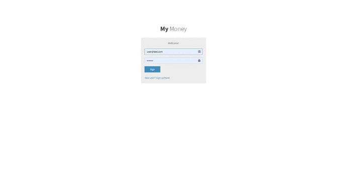
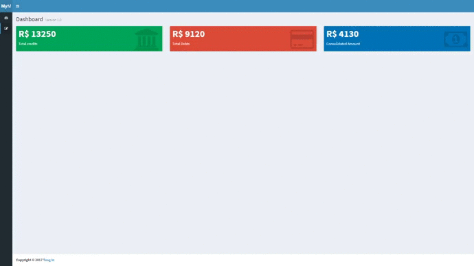

<h1 align="center">
 
  
 
 
MY MONEY APP
</h1>

My money app it is an application for registration and analysis of payment cycles, such as credit and debit. 

  

[//]: # 

  

  
   

[//]: # 

  

  
   

## Features
[//]: # (Add the features of your project here:)
This app features all the latest tools and practices in web development!

- ⚛️ **React Js** — A JavaScript library for building user interfaces
- ⚛️ **Redux** - Application status controller
- 💹 **Node Js** — A web framework for Node Js
- 📄 MongoDB — A cross-platform and open-source document-oriented database

## Getting started

1. Clone this repo using `git clone https://github.com/igortuag/my-money-app-ReactJS.git`
2. Move yourself to the appropriate directory: `cd React-Calculator` 
3. Run `npm install` to install dependencies 
4. Run `npm run dev` or `npm run dev production` to run the app

## License

This project is licensed under the MIT License - see the [LICENSE](https://opensource.org/licenses/MIT) page for details.
